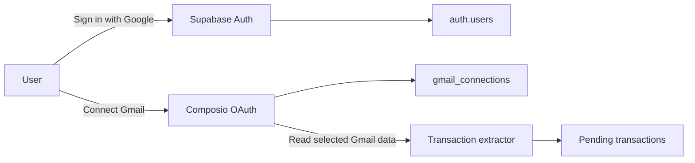
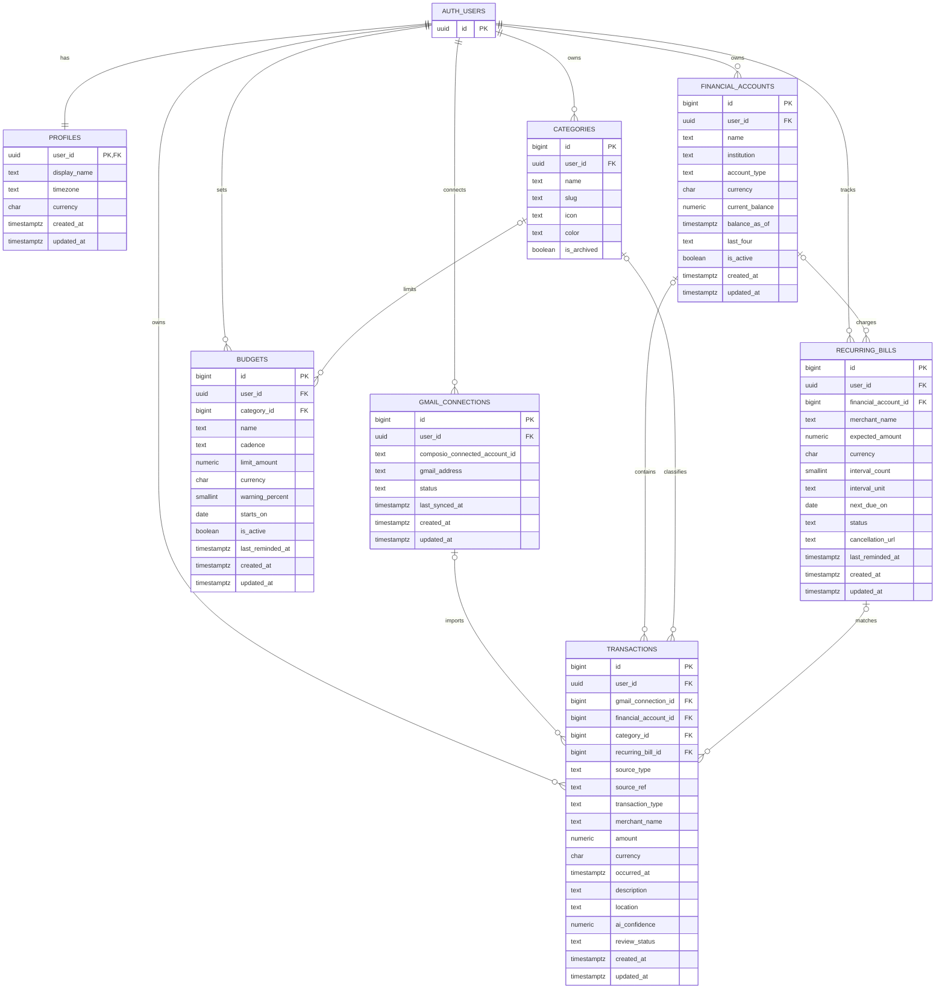

# Monara MVP ERD

Status: design only. No SQL or database migration is created by this document.

## Hackathon scope

Build the shortest complete loop:

1. User signs in with Google through Supabase Auth.
2. User separately connects one or more Gmail accounts through Composio.
3. Composio reads finance-related emails and the extractor creates pending transactions.
4. User confirms or rejects each transaction.
5. Confirmed transactions power the dashboard, budgets, recurring bills, and reminders.

Asset allocation, risk profiling, crypto positions, WhatsApp/WeChat bookkeeping, shared households, and receipt storage are after the hackathon core.

## Two separate Google connections

- **Google login** authenticates the Monara user. Request only `openid`, `email`, and `profile` through Supabase Auth.
- **Connect Gmail** authorizes inbox access through Composio. It is a different consent flow and may use a different Google account.
- Use the Supabase `auth.users.id` as the Composio user ID.
- Store only the Composio connected-account ID in Monara. Composio stores and refreshes Gmail credentials.
- Never reuse Supabase's Google provider token for Gmail ingestion.

References: [Supabase Google login](https://supabase.com/docs/guides/auth/social-login/auth-google) and [Composio authentication](https://docs.composio.dev/docs/authentication).

## MVP ERD

## Functional rules

- A user may connect multiple Gmail accounts. Login email and connected Gmail email do not have to match.
- `gmail_connections (user_id, gmail_address)` and `composio_connected_account_id` are unique.
- Gmail imports store only normalized transaction data. Do not store raw email bodies or OAuth tokens.
- `transactions (gmail_connection_id, source_ref)` is unique when both values exist. `source_ref` is the Gmail message ID plus item index when one email contains multiple transactions.
- Imported transactions start as `pending`; only `confirmed` rows affect totals, budgets, and recurring-bill matching.
- `amount` is positive and exact. `transaction_type` is `expense`, `income`, or `transfer`.
- Budget spending is calculated from confirmed transactions. Do not store a mutable `budget_spent` value.
- Reminder state stays on `budgets.last_reminded_at` and `recurring_bills.last_reminded_at`; there is no notification-log table.
- A detected recurring bill remains `pending` until the user confirms it.

## Deliberately omitted

No `auth_logs`, `sync_logs`, `agent_logs`, `raw_emails`, `oauth_tokens`, `notifications`, or generic provider framework.

For the hackathon:

- Composio owns Gmail credentials and connection lifecycle.
- Supabase Auth owns login sessions.
- Monara stores only product state visible or necessary to users.
- Operational failures are returned to the UI directly; add durable job history only when background retries become real.

## Security and integrity

- Enable RLS on every public table.
- Every policy checks `user_id = (select auth.uid())` for authenticated users.
- Index every `user_id` and foreign-key column.
- Enforce same-user relationships with composite foreign keys such as `(financial_account_id, user_id)`.
- Use `numeric` for money, `timestamptz` for events, and uppercase ISO 4217 currency codes.
- The PWA receives only the Supabase URL and publishable key. Composio, Supabase secret/service-role, and Google OAuth secrets stay server-side.

## Build order

1. Supabase Google login and `profiles`.
2. Composio Gmail connect/disconnect and `gmail_connections`.
3. Import recent emails into pending `transactions` with deduplication.
4. Confirm/reject UI, categories, accounts, and dashboard totals.
5. Budgets with one warning threshold.
6. Recurring-bill detection and due reminder.

Stop there for the hackathon. Add assets, risk scoring, crypto, and chat channels only after this loop works end to end.
