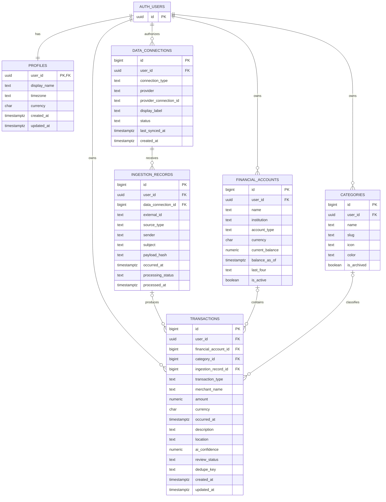
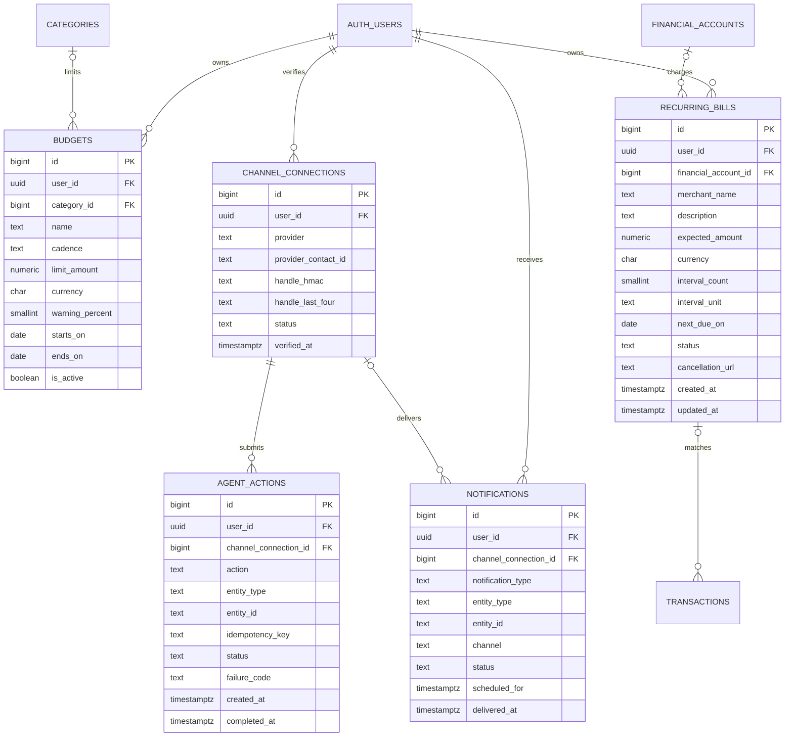
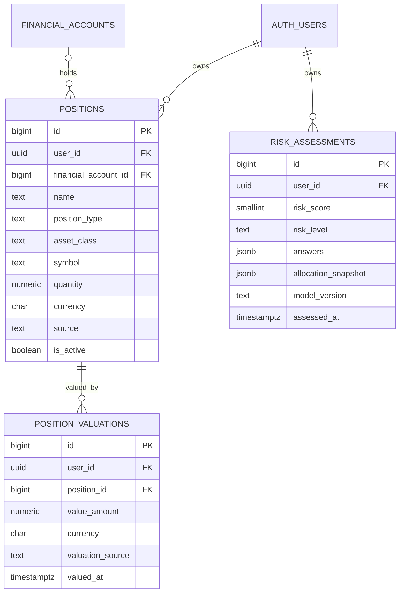

# Monara ERD

Status: design only. This document does not create or migrate any database.

## Scope

Monara is single-user personal finance software. Supabase team members are project collaborators, not tenants inside the product. Every financial row belongs to one authenticated user.

The design is split into three delivery phases so the MVP can ship without carrying asset-management complexity.

## Phase 1 — automatic expense tracking

Important constraints:

- `data_connections (user_id, provider, provider_connection_id)` is unique.
- `ingestion_records (data_connection_id, external_id)` is unique so one email or provider event is processed once.
- `transactions (user_id, dedupe_key)` is unique when `dedupe_key` is present.
- `amount` is positive and exact; `transaction_type` carries `expense`, `income`, or `transfer`.
- Imported transactions start as `pending`. Only `confirmed` transactions count toward totals and budgets.
- OAuth tokens and raw email bodies are not stored in public tables. Keep credentials in the provider/backend secret store.

## Phase 2 — budgets, bills, reminders, and chat agents

Budget usage is derived from confirmed transactions. Do not create a mutable `budget_spent` column. A recurring bill may be detected automatically, but the user confirms it before reminders become active.

Phase 2 adds nullable `transactions.recurring_bill_id`. Keep `(user_id, idempotency_key)` unique on `agent_actions` so provider retries cannot repeat a write.

`agent_actions` is an audit and idempotency record for WhatsApp/WeChat CRUD. It stores the interpreted action, not raw conversation content.

## Phase 3 — assets and risk profile

Assets and liabilities share `positions`; `position_type` distinguishes them. Bank, brokerage, exchange, and crypto-wallet holdings reuse `financial_accounts` instead of introducing provider-specific account tables. On-chain transactions reuse the Phase 1 transaction pipeline; the provider event or transaction hash lives in `ingestion_records.external_id`.

## Security and integrity rules

- Every public table enables RLS and checks `user_id = (select auth.uid())`.
- Every `user_id` used by RLS is indexed.
- Child references must belong to the same user; enforce this with composite foreign keys such as `(financial_account_id, user_id)`.
- Foreign-key columns are indexed.
- Money uses `numeric`, time uses `timestamptz`, and currencies use uppercase ISO 4217 codes.
- Public clients use only the Supabase publishable key. Secret/service-role keys never enter the PWA.
- Never use profile metadata supplied by the user for authorization.

## Build order

1. Profiles, categories, financial accounts.
2. Email connection metadata and ingestion deduplication.
3. Pending/confirmed transactions.
4. Budgets and recurring bills.
5. Notifications and verified WhatsApp/WeChat actions.
6. Positions, valuations, and risk assessments.

Do not add merchant normalization, shared households, exchange-specific tables, receipt storage, or materialized dashboard totals until real usage proves they are needed.
